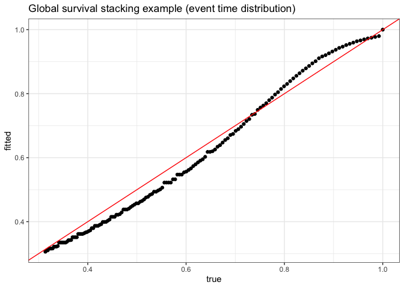
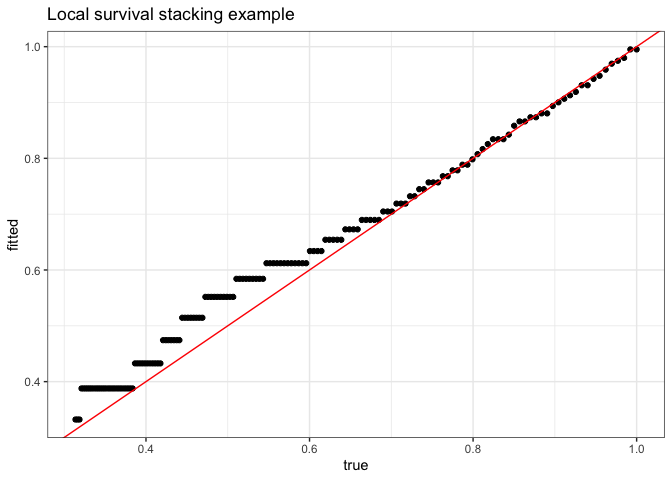

<!-- README.md is generated from README.Rmd. Please edit that file -->

# `survML`: Conditional survival function estimation using machine learning

The `survML` package implements two methods for estimating a conditional
survival function using off-the-shelf machine learning. The first,
called *global survival stacking* and performed using the `stackG()`
function, involves decomposing the conditional hazard function into
regression functions depending only on the observed data. The second,
called *local survival stacking* or discrete-time hazard estimation,
involves discretizing time and estimating the probability of an event of
interest within each discrete time period. This procedure is implemented
in the `stackL()` function. More details on each method, as well as
examples, follow.

## Installing `survML`

**Note: `survML` is currently under development.**

The development version of `survML` is available on GitHub. You can
install it using the `devtools` package as follows:

``` r
## install.packages("devtools") # run only if necessary
install_github(repo = "cwolock/survML")
```

## Global survival stacking

In a basic survival analysis setting with right-censored data (but no
truncation), the ideal data for each individual consist of a covariate
vector
,
an event time
,
and a censoring time
.
The observed data consist of
,
the observed follow-up time
"),
and the event indicator
").
Global survival stacking requires three components: (1) the conditional
probability that

given
,
(2) the CDF of

given

among among censored subjects, and (3) the CDF of

given

among uncensored subjects. All three of these can be estimated using
standard binary regression or classification methods.

For maximum flexibility, `survML` uses Super Learner for binary
regression. Estimating (1) is a standard binary regression problem. We
use pooled binary regression to estimate (2) and (3). In essence, at
time

each on a user-specified grid, the CDF is a binary regression using the
outcome
").
The data sets for each

are combined into a single, pooled data set, including

as a covariate.

The `stackG` function performs global survival stacking. The most
important user-specified arguments are described here:

-   `bin_size`: This is the size of time grid used for estimating (2)
    and (3). In most cases, a finer grid performs better than a coarser
    grid, at increased computational cost. We recommend using as fine a
    grid as computational resources and time allow. In simulations, a
    grid of 40 time points performed similarly to a grid of every
    observed follow-up time. Bin size is given in quantile terms;
    `bin_size = 0.025` will use times corresponding to quantiles
    .
    If `NULL`, a grid of every observed time is used.
-   `time_basis`: This is how the time variable
    
    is included in the pooled data set. The default is `continuous`
    (i.e., include time as-is). It is also possible to include a dummy
    variable for each time in the grid (i.e., treat time as a `factor`
    variable) using option `dummy`.
-   `SL_contrl`: This is a named list of arguments that are passed
    directly to the `SuperLearner()` function. `SL.library` gives the
    library of algorithms to be included in the Super Learner binary
    regression. This argument should be vector of algorithm names, which
    can be either default algorithms included in the `SuperLearner`
    package, or user-specified algorithms. See the `SuperLearner`
    package documentation for more information.

### Example

Here’s a small example applying `stackG` to simulated data.

``` r
# This is a small simulation example
set.seed(123)
n <- 500
X <- data.frame(X1 = rnorm(n), X2 = rbinom(n, size = 1, prob = 0.5))

S0 <- function(t, x){
  pexp(t, rate = exp(-2 + x[,1] - x[,2] + .5 * x[,1] * x[,2]), lower.tail = FALSE)
}
T <- rexp(n, rate = exp(-2 + X[,1] - X[,2] + .5 *  X[,1] * X[,2]))

G0 <- function(t, x) {
  as.numeric(t < 15) *.9*pexp(t,
                              rate = exp(-2 -.5*x[,1]-.25*x[,2]+.5*x[,1]*x[,2]),
                              lower.tail=FALSE)
}
C <- rexp(n, exp(-2 -.5 * X[,1] - .25 * X[,2] + .5 * X[,1] * X[,2]))
C[C > 15] <- 15

time <- pmin(T, C)
event <- as.numeric(T <= C)

SL.library <- c("SL.mean", "SL.glm", "SL.gam", "SL.earth")

fit <- stackG(time = time,
              event = event,
              X = X,
              newX = X,
              newtimes = seq(0, 15, .1),
              direction = "prospective",
              bin_size = 0.02,
              time_basis = "continuous",
              time_grid_approx = sort(unique(time)),
              surv_form = "exp",
              SL_control = list(SL.library = SL.library,
                                V = 5))
```

We can plot the fitted versus true conditional survival at various times
for one particular individual in our data set:

``` r
plot_dat <- data.frame(fitted = fit$S_T_preds[1,], 
                       true = S0(t =  seq(0, 15, .1), X[1,]))

p <- ggplot(data = plot_dat, mapping = aes(x = true, y = fitted)) + 
  geom_point() + 
  geom_abline(slope = 1, intercept = 0, color = "red") + 
  theme_bw() + 
  ylab("fitted") +
  xlab("true") + 
  ggtitle("Global survival stacking example")

p
```

<!-- -->

## Local survival stacking

### Example

``` r
fit <- stackL(time = time,
              event = event,
              X = X,
              newX = X,
              newtimes = seq(0, 15, .1),
              direction = "prospective",
              bin_size = 0.02,
              time_basis = "continuous",
              SL_control = list(SL.library = SL.library,
                                V = 5))
```

``` r
plot_dat <- data.frame(fitted = fit$S_T_preds[1,], 
                       true = S0(t =  seq(0, 15, .1), X[1,]))

p <- ggplot(data = plot_dat, mapping = aes(x = true, y = fitted)) + 
  geom_point() + 
  geom_abline(slope = 1, intercept = 0, color = "red") + 
  theme_bw() + 
  ylab("fitted") +
  xlab("true") + 
  ggtitle("Local survival stacking example")

p
```

<!-- -->

## References

For details of this method, please see the following preprint:

Charles J. Wolock, Peter B. Gilbert, Noah Simon and Marco Carone. “A
framework for leveraging machine learning tools to estimate personalized
survival curves.” (2022).
